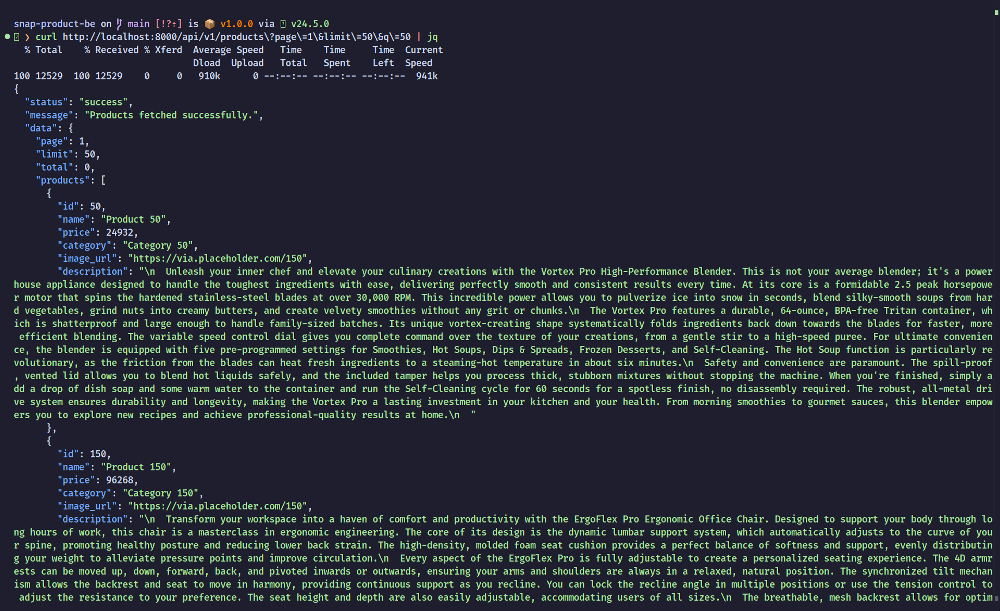
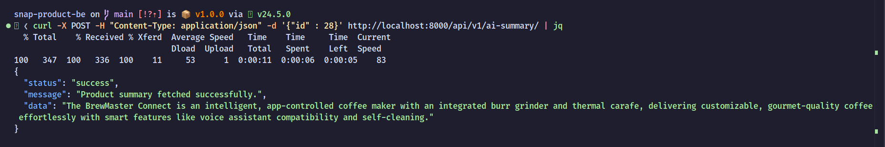
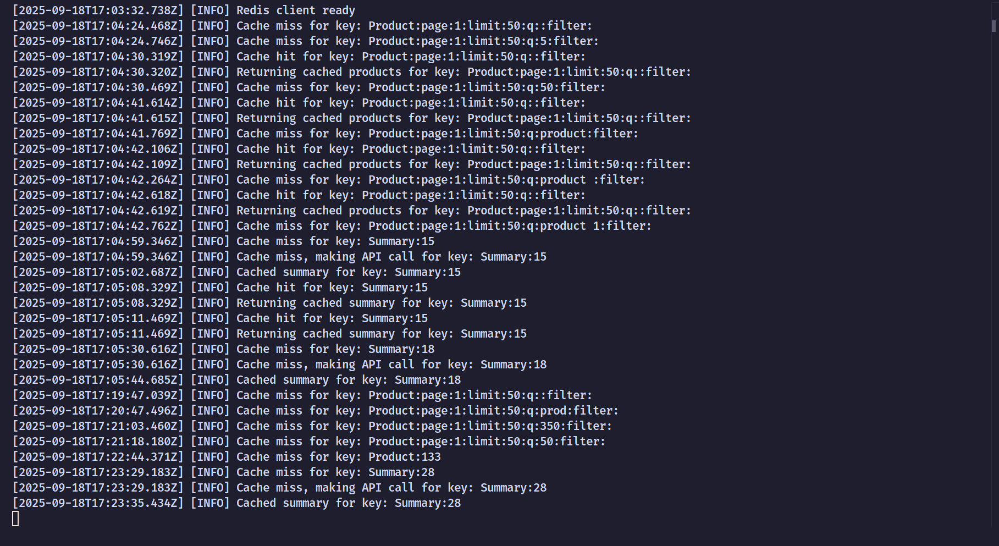

# Snap Product Catalog

## Project Overview

Product catalog is a test project. All the features are based on the requirements (Functionality priority)

## Tech Stack

- **Backend**: Express.js
- **FrontEnd**: Flutter
- **Cache**: Redis
- **Database**: SQLite3

## Why Choose This Backend?

This backend architecture is designed to be simple and lightweight, focusing specifically on MVP core features. It provides a fast development cycle and easy deployment while maintaining the essential functionality needed for a product catalog system.

## How to Setup

### BackEnd Service

#### Option 1: Docker (Recommended)

First, clone the repository:

```bash
git clone <repository-url>
cd snap-product-be
```

Build the image:

```bash
docker build -t product-catalog .
```

#### Option 2: Manual Installation

First, clone the repository:

```bash
git clone <repository-url>
cd snap-product-be
```

Install dependencies:

```bash
npm i
```

Build:

```bash
npm run build
```
### FrontEnd 

Go to mobile flutter directory
```bash
cd product_catalog_app
```

Install dependency
```bash
flutter pub get
```

## How to Run

### BackEnd

#### Option 1: Docker (Recommended)

Run the container:

```bash
docker compose up -d
```

View logs:

```bash
docker logs product-catalog-service
```

#### Option 2: Manual

Run npm:

```bash
npm start
```

### FrontEnd

Run app
```bash
flutter emulator --launch <emulator-id>
```

## Testing

Run tests using Jest:

```bash
npm test
```

## Available Endpoints

- `GET /api/v1/products/` - Get all products
- `GET /api/v1/products/:id` - Get product by ID
- `POST /api/v1/ai-summary` - Generate AI summary (JSON body with id as product id)

## Screenshots

### API Docs

**Get All Products**


G**Get Product by ID**


G**Get All Products**


G**Get Logs**


### Demo video (FrontEnd and BackEnd)
https://drive.google.com/file/d/1zPKOaEOt4ulpJYIWNYqqRQt0mo9e5Wab/view?usp=drive_link

*Screenshots will be added here*

## NOTE
1. Since this is for a test project, I wrote the Gemini API key to the Docker env to make dev easier. This is a free-tier API key so it will be changed soon.
2. Since I'm only using localhost, you need to adjust the network IP for mobile app on `product_catalog_app/lib/service/api_service.dart`
```dart
static const String baseUrl = 'http://192.168.1.22:8000/api/v1';
```